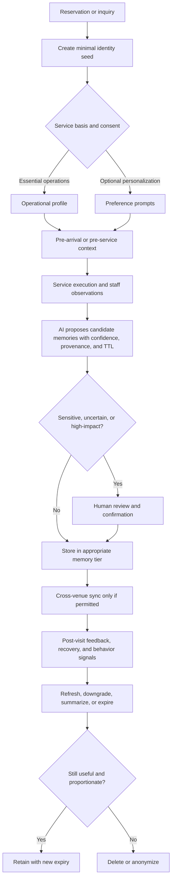

> Research archive note: This document is supporting research for HESTIA Venue Intelligence. It is not canonical product doctrine and should not be implemented directly without passing HESTIA's provenance, confidence, role-access, venue-boundary, and human-approval guardrails.
> Automation and AI-agent ideas in this document are research direction only. They are not current production behavior, require real evidence, and must not create fake operational truth or bypass human approval for high-impact decisions.

# Designing a Guest Intelligence Layer for HESTIA

## Executive summary

A true **Guest Intelligence Layer** is not a better CRM. It is an operating layer that helps a venue understand a guest as a **temporary person-in-place**, not as a demographic segment or a lead in a funnel. In hospitality, value is co-created live, in a physical environment, under social observation, with emotional stakes and time pressure. Guests are not buying only food, drink, or a room; they are also buying relief, status, privacy, celebration, certainty, belonging, romance, recovery, convenience, and the right story to tell afterward. That is why hospitality intelligence must model **occasion, context, emotion, pace, social setting, preferences, boundaries, and memory quality** more than static profile attributes. Research on guestology, servicescape, social servicescape, meal experience, hotel choice, and hospitality listening all point in the same direction: the determinants of choice, satisfaction, and loyalty are situational and relational, not merely transactional. 

The best exemplars all use the same pattern. Ritz-Carlton codifies anticipatory service around expressed and unexpressed needs, name use, problem ownership, and privacy protection. Four Seasons combines pre-arrival questions, human chat, cross-department briefings, and name recognition to make personalization feel coordinated rather than scripted. Union Square Hospitality Group frames service as **Enlightened Hospitality**, with emotional hospitality and technical excellence working together. Will Guidara’s articulation of “unreasonable hospitality” pushes the same idea further: hospitality works best when it treats people as unique individuals rather than standardized accounts. Aman operationalizes discreet tailored service, but its privacy notice also shows how easily luxury personalization can become expansive data collection if not tightly governed. Soho House shows that memory and belonging work best when they are nested inside a **community model with clear behavioral and confidentiality norms**. Concierge practice adds the final lesson: context matters more than raw data; the best recommendations come from a few well-judged questions plus trusted local knowledge. 

For HESTIA, the implication is clear. The system should learn **useful, proportionate, confidence-weighted guest memory**. It should store only what helps deliver better hospitality. It should connect reservations, table management, PMS/POS signals, communications, service notes, and recovery history into one contextual graph. It should forget unconfirmed, stale, gossip-like, or sensitive inferences. It should protect guests through minimization, purpose limitation, role-based access, consent for higher-sensitivity uses, human review for consequential inferences, and expiration by default. And it should update memory continuously, but only after distinguishing between a **one-off situational preference** and a **durable preference**. Those design choices are strongly aligned with NIST’s privacy and AI risk frameworks, GDPR principles such as purpose limitation and data minimization, and regulatory guidance around profiling and automated decision-making. 

The practical architecture should therefore revolve around six verbs. **Learn** observable preferences, situational cues, service sensitivities, motivations, and recovery patterns. **Store** only confirmed or high-confidence memories with provenance and expiry. **Connect** information across venues only when the guest relationship and consent model justify it. **Forget** stale, low-confidence, embarrassing, or overly intimate details. **Protect** identity and sensitive data with strict access rules, pseudonymization, and human oversight. **Update** memory after each interaction using confidence scores and time decay rather than by accumulating an ever-growing dossier. That is the foundation of a hospitality-native intelligence layer. 

## Hospitality guests are not generic customers

What makes hospitality guests different is not merely purchase frequency or ticket size. It is that the product is **immersive, embodied, co-produced, time-bound, and publicly visible**. In a hotel, restaurant, bar, or event venue, the guest experiences the service through the environment, the behavior of staff, the behavior of other guests, and their own role in the interaction. Hospitality research consistently treats the guest experience as the interaction of **service product, service setting, and service delivery**, and shows that guests arrive with expectations about behavior, ambiance, pace, value, and even how much service is “enough.” Because the guest is physically present, small mismatches feel larger than in generic commerce: noise, table position, staff tone, crowd density, room placement, or over-attention can change the entire experience. 

That is why demographics are weak foundations for hospitality intelligence. Two guests of the same age, income, and home city may want opposite experiences depending on whether tonight is a date, a proposal, a client dinner, a jet-lagged late arrival, a solo drink, or a birthday gathering. Restaurant choice studies show that importance weights change by occasion: price matters more for convenience and social occasions, brand reputation matters more for business necessity, and word-of-mouth matters more for celebration. Hotel choice research likewise shows that attribute salience changes by trip purpose, with value, service, rooms, sleep quality, location, and cleanliness weighted differently by business travelers, couples, families, friends, and solo travelers. In other words, the strongest unit of analysis is not the person alone but the **person-in-occasion**. 

The deepest drivers of guest behavior are emotional, social, cultural, and situational. Emotion matters because anticipated feelings shape dining-out intention and because positive and negative emotions influence loyalty and switching behavior. Social context matters because other customers, employee behavior, and social density alter satisfaction and behavioral intentions in both hotels and restaurants. Culture matters because norms affect what feels celebratory, polite, indulgent, safe, or intrusive, and because dissatisfaction is voiced differently across cultures. Situation matters because context changes the decision frame: a guest after a long flight is not making the same trade-offs as a local coming for cocktails. These are exactly the dimensions a great concierge or maître d’ evaluates in seconds. 

From first principles, guests choose one venue over another when they believe it will better solve a specific emotional and situational job: “make this night feel special,” “remove risk,” “help me impress,” “let me disappear,” “give me certainty,” “make this easy,” “help me belong,” or “give me a story worth retelling.” Studies of restaurant and hotel selection reinforce this: food quality, service quality, atmosphere, price, convenience, location, cleanliness, comfort, value, reviews, and reputation all matter, but their ranking changes by context. Guests return when a place repeatedly gets the **fit** right: not only competent service, but the right pace, the right recommendation, the right room placement, the right degree of recognition, and the right emotional aftertaste. Satisfaction is necessary but not sufficient; the hospitality literature repeatedly notes a gap between satisfaction and loyalty, and more recent work shows that emotional attachment and memorable experiences mediate revisit and positive voice behavior. 

Guests complain when a venue violates what mattered most to them in that moment: fairness, dignity, pace, competence, privacy, safety, or meaning. Restaurant studies on dissatisfaction responses show that many guests do **not** complain; some simply do not return, and silent customers are more likely to defect than those who voice a complaint. Service recovery helps, but even successful recovery does not fully erase the negative effect of the original failure, and double failures are especially damaging. Silent churn therefore happens when the venue misses the guest’s emotional stakes yet never captures a signal strong enough to trigger recovery. For HESTIA, that means the absence of complaint must never be read as satisfaction. 

## How guest behavior actually works

A great host notices what systems usually miss: pace of speech, gaze, hesitations before ordering, who in the party is deciding, whether the table wants privacy or guidance, whether the smile is polite or genuinely relaxed, whether the guest is adventurous tonight or exhausted, whether someone is celebrating but wants subtlety, whether a “yes” is enthusiastic or merely compliant, and whether the group is synchronized or socially tense. Cornell’s work on listening in hospitality is especially revealing here: effective listening improves accuracy, trust, service customization, satisfaction, loyalty, and perceptions of integrity. Concierge practice says the same thing in applied form: a few guiding questions about romance, food versus ambiance, weather, timing, and energy level lead to better recommendations than generic algorithmic matching. 

The strongest signals of guest satisfaction are therefore not generic scores; they are **behavioral trust signals**. The most reliable are repeat bookings, shorter future decision cycles, willingness to accept recommendations, direct referrals, detailed positive reviews that mention specifics, constructive feedback intended to help the venue improve, and cross-occasion expansion such as moving from regular dining to private dining, events, or longer stays. Research on emotional attachment, guest voice behavior, delight, and memorable experiences supports this emphasis on specific, voluntary, behaviorally costly signals. By contrast, the weakest or most misleading signals are high spend by itself, polite silence, one-off five-star ratings with no text, forced loyalty enrollments, and one-time special-occasion bookings. Hospitality research also cautions that ratings and intentions are imperfect proxies: online ratings simplify complex experience judgments, and revisit intention does not always translate into actual repeat behavior. 

The decision process within a venue is highly domain-specific. For **cocktails**, many guests rely on interaction rather than pure menu reading; cocktail bartenders act as cultural intermediaries who match the guest to the “right” drink through face-to-face service work. For **wine**, attitude, perceived behavioral control, and especially subjective knowledge affect purchase intention, while branded wine lists reduce decision time and increase preference for mid- to high-priced wines. For **food**, familiarity, risk tolerance, menu descriptions, and reviews shape choice. For **price**, perceived fairness matters as much as sticker level, especially in upscale dining. For **seating**, guests react to socio-spatial distance, density, privacy, and placement relative to staff and other customers. For **hotels**, location, cleanliness, comfort, service, food, rooms, value, and sleep quality remain core. For **service quality**, personalized attention and hospitable employee behavior remain central drivers of satisfaction and loyalty. 

Occasion changes everything. A **date** amplifies privacy, pacing, atmosphere, and the risk of embarrassment. A **birthday** increases the value of recognition, but only if it matches the guest’s desired visibility. A **business dinner** shifts attention toward reliability, timing, acoustics, discretion, and brand reputation. A **wedding** or large celebration increases coordination needs, social signaling, and the importance of event recovery. A **hotel stay** multiplies touchpoints and therefore multiplies opportunities for either coherence or friction. A **regular visit** makes consistency and remembered preferences more important than novelty. A **casual drink** favors low-friction recommendations and bar energy. A **tourist visit** increases information asymmetry and dependence on local expertise. A **local neighborhood visit** places more weight on ease, habit, belonging, and “third place” identity. These occasion effects are directly supported by restaurant occasion studies and indirectly by hotel trip-purpose studies, social-servicescape work, and concierge practice. 

The following signal matrix is a practical translation for HESTIA.

| Signal | Why it is strong or weak | Operational reading for HESTIA | Evidence |
|---|---|---|---|
| Repeat booking or visit within a relevant time window | Costly, behavioral, harder to fake | Strong loyalty/relevance signal |  |
| Detailed positive review naming specifics | Indicates memorable elements, not generic mood | Strong signal of what to preserve |  |
| Acceptance of staff recommendations | Indicates trust, not just satisfaction | Strong predictor of recommendation logic fit |  |
| Constructive complaint or suggestion | Invested guests often voice to improve the relationship | Important loyalty and recovery signal |  |
| Cross-occasion expansion | Guest trusts the venue for a broader role in life | Very strong relationship-growth signal |  |
| High spend on a single visit | Can reflect occasion, client entertaining, or lack of alternatives | Weak alone; must be normalized by occasion/context |  |
| No complaint | Silent dissatisfied guests often defect | Do not read as satisfaction |  |
| Single star rating with no text | Useful but low-resolution proxy | Supplement with behavior and narrative |  |
| Revisit intention survey response | Not identical to actual behavior | Useful directional signal, not ground truth |  |
| Social media vanity metrics | Attention is not attachment | Avoid over-weighting |  |

## Patterns from world-class exemplars

Across the exemplars, the recurring pattern is **human judgment supported by structured memory**. Ritz-Carlton’s service philosophy explicitly instructs staff to anticipate and fulfill needs, respond to expressed and unexpressed wishes, create unique and personal experiences, own and immediately resolve problems, and protect privacy and security. Four Seasons' official material emphasizes deeply instilled personal service, digital tools that remain “human and thoughtful,” real-person chat before, during, and after the stay, and pre-arrival questions such as check-in time, purpose of visit, and family needs. Its Minneapolis property also describes daily internal briefings so staff across departments know who is arriving and whether they are celebrating. This is not personalization through blasting offers; it is personalization through **purposeful operational choreography**. 

Danny Meyer’s USHG and Will Guidara articulate the same pattern in the language of culture. USHG says it extends Enlightened Hospitality and looks for talent whose skills combine emotional hospitality and technical excellence; Danny Meyer’s profile states that prioritizing employees first has shaped the group’s culture. Guidara’s formulation is especially useful for HESTIA: if hospitality is about making people feel seen, “one size fits one.” That does not mean endless customization. It means finding the smallest detail that proves understanding. Humm Hospitality’s present-day official mission is to have a positive impact on people’s lives, and Eleven Madison Park’s current structure still highlights dedicated guest relations and private events roles, but the operational articulation of its legendary guest-first style is better preserved in Guidara’s own philosophy than on EMP’s current website. 

Disney’s contribution is design discipline. “Guestology,” a Disney-origin concept described in hospitality teaching literature, means studying guests scientifically from the guest’s point of view: their wants, needs, capabilities, and expectations. Disney Institute’s official material continues this framing by presenting customer service practices designed to drive loyalty and exceed expectations. Disney’s lesson for HESTIA is that memory should never stand alone; it must be tied to **service product, service setting, and service delivery**. In other words, knowing the guest likes quiet is useless if the venue cannot operationally seat them in a protected zone or place them in a quiet room away from service areas. 

Aman and Soho House are especially useful because they show the trade-off between intimacy and governance. Aman markets discretion, private space, tailored itineraries, and multilingual concierge planning, and its careers material defines the brand around warm personalized hospitality. But Aman’s privacy notice also illustrates the complexity of luxury guest data: it gathers data across reservations, visits, concierge, restaurants, spa, activities, shared services, and even connected devices, and uses that data for on-site recognition, personalization, and service improvement. Soho House, by contrast, builds personalization through a membership community with explicit behavior standards, membership photos, confidentiality commitments, and review by a Membership Behaviour Committee. Both cases teach the same rule: personalization works best when the venue is explicit about the **relationship model** and the **boundaries**. 

Luxury concierge practice sharpens the final point. Les Clefs d’Or emphasizes that concierges are local experts because they go where they recommend. Forbes Travel Guide’s 2026 profile of the Four Seasons Toronto concierge explains why AI alone is insufficient: “context is everything,” and a concierge can decide in seconds whether a guest wants romance, food, ambiance, speed, weather protection, or something impossible to infer from online data alone. For HESTIA, that means world-class memory is not “remember everything.” It is **remember just enough to ask better questions and make better judgments**. 

Fine dining reservation notes and modern table-management tools support the same model operationally. Resy, OpenTable, and SevenRooms all formalize guest notes, visit notes, tags, and profiles. But the best use of those notes is not surveillance; it is shift readiness: “anniversary, prefers quieter corner, shellfish allergy, last visit delayed mains and accepted apology.” The note should help a host or server act more gracefully on the next visit, not turn the guest into an exhaustively tracked subject. 

## The Guest Intelligence Framework

The framework below is designed for HESTIA as a **hospitality memory system**, not a demographic segmentation engine.

| Category | Why it matters | What to collect | How to collect naturally | How often it changes | How AI should use it | How AI should avoid misuse | Evidence |
|---|---|---|---|---|---|---|---|
| Guest Identity | Recognition reduces friction and supports dignity when done accurately | Preferred name, pronunciation, loyalty/member linkage, role in party, local vs traveler status | Reservation forms, verified profile, host greeting, opt-in app/account | Low; verify when uncertain | Route service, greet correctly, avoid duplicate records | Never guess nicknames, titles, relationships, or status from appearance/social scraping |  |
| Guest Occasion | Occasion is the highest-leverage predictor of needs | Visit purpose, celebration type, visibility preference, stake level | Pre-arrival question, reservation note, host conversation | High; visit-specific | Adapt pacing, offers, room/table assignment, recovery priorities | Never assume every repeat date or birthday wants public recognition |  |
| Guest Motivation | Choice is driven by the job the venue solves | Romance, convenience, escape, status, certainty, exploration, belonging, privacy | Few guided questions; booking channel; behavior patterns | Medium; can vary by occasion | Rank recommendations by motive, not just popularity | Avoid reductive labels like “VIP spender” when motive is actually “quiet rest” |  |
| Guest Emotional State | Emotion changes recommendation fit and recovery urgency | Energy, stress, urgency, sociability, frustration, delight indicators | Staff observation, language cues, chat tone, complaint tone | Very high; moment-to-moment | Soften scripts, shorten choices, escalate recovery, adjust pacing | Do not store transient mood as a durable personality trait |  |
| Guest Preference Memory | Preference memory creates “seen” moments | Room/floor/noise preferences, seating zone, water style, favorite flavor profiles, dietary needs, preferred check-in style | Repeated observations, order history, pre-arrival forms, staff notes | Some durable, some episodic | Pre-select likely fits and reduce friction | Distinguish one-off choices from stable preferences; require confirmation over time |  |
| Guest Spending Behavior | Spend reveals constraints and comfort range, but only in context | Bill ranges by occasion, add-on acceptance, timing, category spend mix | POS/PMS data linked to visit context | Medium | Set sensible recommendation bands and offer ladders | Never treat raw spend as satisfaction or worthiness of dignity |  |
| Guest Service Sensitivity | Some guests are especially sensitive to delay, noise, over-attention, or inconsistency | Waiting tolerance, seating/privacy sensitivity, noise sensitivity, pace preference, recovery threshold | Timing data, prior notes, direct requests, complaint history | Medium to high | Prevent known irritants and prioritize service sequencing | Avoid stigmatizing the guest as “difficult”; store the trigger, not the judgment |  |
| Guest Communication Style | Matching communication style reduces friction | Channel preference, directness, brevity, formality, response latency | Chat/app/email behavior, host interaction | Medium | Choose concise vs rich messaging; decide when to message vs call | Do not infer culture, class, or personality too aggressively from writing style |  |

| Category | Why it matters | What to collect | How to collect naturally | How often it changes | How AI should use it | How AI should avoid misuse | Evidence |
|---|---|---|---|---|---|---|---|
| Guest Complaint Signals | Early detection prevents silent churn | Delay spikes, negative sentiment, repeated small frictions, review behavior, partial complaints | Service logs, review text, staff notes, recovery records | High around failures | Trigger discreet recovery; flag unresolved issues | Do not wait for explicit complaint; do not label silence as satisfaction |  |
| Guest Loyalty Signals | Loyalty is trust and preference under uncertainty | Repeat visits, shorter rebooking cycles, referrals, accepted recommendations, cross-occasion usage | Reservation/PMS/POS history, referral codes, event upgrades | Medium | Prioritize continuity and preserve what already works | Do not equate loyalty with only volume or membership badge |  |
| Guest Social Context | Companion mix changes behavior and choices | Party size, who leads ordering, children, clients, romantic partner, family pattern, host/guest role | Reservation details, host observation, event brief | High; visit-specific | Tailor service choreography, seating, pacing, recommendation style | Avoid guessing relationships from appearance or storing gossip |  |
| Guest Privacy Boundaries | Recognition feels premium only when it respects space | Public vs discreet acknowledgment, surprise vs subtlety, contact consent, cross-property sharing consent | Direct preference prompt, opt-in center, prior reactions | Medium | Decide whether to greet publicly, message later, or do nothing | Over-recognition is a failure; never use off-platform stalking as standard practice |  |
| Guest Lifetime Value | LTV should include relational and referral value, not just revenue | Revenue, margin, referral value, event potential, recovery cost, strategic relevance | Aggregated from verified history | Medium | Allocate thoughtful effort and assign follow-up priorities | Never ration respect, recovery, or essential service by LTV tier |  |
| Guest Experience History | Memory is only useful when grounded in actual visits | Past visits, tables/rooms used, menu/wine history, successful recoveries, key moments | Reservation/POS/PMS integration, shift notes | Cumulative | Create continuity and prevent repeat mistakes | Keep provenance; avoid mixing rumor with fact |  |
| Guest Recovery History | Recovery success or failure is one of the strongest future predictors | Issue type, remedy, speed, guest reaction, unresolved root cause | Complaint workflow, manager notes | Event-driven | Personalize future recovery and prevention plans | Do not keep inflammatory language longer than needed; store outcome and trigger |  |
| Guest Recommendation Logic | Recommendation quality is where intelligence becomes visible | Flavor/style anchors, budget comfort, novelty appetite, timing, dietary limits, seating/privacy fit | Conversational elicitation plus confirmed history | High with some durable elements | Offer a few high-fit options with reasons | Avoid steering to highest-margin choice when fit is lower |  |

From this framework, HESTIA’s central rule should be simple: **remember the minimum detail that increases future fit**. A good memory is specific, useful, respectful, and revisitable. “Prefers a quiet room away from elevators” is good memory. “Anxious person who dislikes people” is poor memory. “Enjoyed mineral-driven whites and accepted sommelier guidance” is good memory. “High spender, sell reserve list” is poor memory. “Celebrated privately; do not announce” is good memory. “Likely pregnant” is not acceptable inference. That boundary is both hospitable and privacy-preserving. 

## Operating model for HESTIA

HESTIA should be built around a **tiered memory architecture**. The system should **learn** observable preferences, visit purpose, service sensitivities, response patterns, and recovery triggers. It should **store** only confirmed or high-confidence details that improve future service. It should **connect** reservations, PMS/POS, table management, event sales, concierge requests, messages, and recovery logs into one contextual graph. It should **forget** stale or low-confidence memory and anything that crosses into intimacy without operational necessity. It should **protect** identity, sensitive information, and profiling outputs through minimization, pseudonymization, access tiers, audit trails, and human review. It should **update** memory continuously through time decay and re-confirmation rather than permanent accumulation. Those principles align directly with data life-cycle management in the NIST Privacy Framework and risk-aware human oversight in the NIST AI RMF, and they are reinforced by GDPR principles on minimization, accuracy, and purpose limitation. 

A workable retention model for HESTIA is the following.

| Memory tier | Examples | Default retention | Confirmation rule | Rationale |
|---|---|---|---|---|
| Session memory | “Late arrival tonight,” “jet-lagged,” “birthday but keep subtle” | End of stay/visit to 30 days | No confirmation needed | Purely situational; useful only briefly |
| Occasion memory | Proposal attempt, wedding site visit, annual board dinner pattern | 12–24 months | Confirm on next similar interaction | Occasion recurs, but not continuously |
| Durable preference memory | Quiet room, corner booth, sparkling water, no public fuss | 24 months rolling from last confirmation | Two or more confirming observations or direct guest confirmation | High utility; moderate privacy risk |
| Relationship memory | Preferred channel, loyalty status, cross-venue entitlement | While relationship remains active | Verified source required | Needed for service continuity |
| Recovery memory | Allergy mishandled, anniversary seating failure, comped bottle after delay | 24–36 months, then summarize or anonymize | Manager review required | Prevent repeat harm without creating a permanent grievance file |
| Sensitive operational data | Health/dietary accommodations, accessibility needs | Only as long as necessary for service and legal obligations | Explicit request or lawful necessity | Higher sensitivity; strict access |
| Prohibited memory | Gossip, inferred wealth from appearance, pregnancy guesses, social-media stalking details, political views unless volunteered and operationally necessary | Never store | Not applicable | Not proportional to hospitality purpose |

The onboarding and learning process should also be role-specific.

| Stage | What staff should enter manually | What managers should review | What AI can infer | What AI should not infer | What requires human confirmation | What becomes durable vs expires |
|---|---|---|---|---|---|---|
| Initial reservation | Name, party size, occasion if stated, dietary/accessibility requests, seating/room request | Duplicates, VIP/service-risk flags | Likely motive from channel/time/party pattern | Relationship status, wealth, ethnicity, pregnancy, health beyond explicit requests | Identity merges; sensitive notes | Mostly session memory unless repeated |
| Pre-arrival / pre-service | Purpose of visit, arrival timing, preferred contact channel | Overly invasive questions, staff note quality | Confidence-weighted preference candidates | Anything from external social media by default | Cross-property sharing, special accommodations, surprise execution | Occasion memory if relevant |
| During service | Factual observations: accepted recommendation, disliked noise, rushed pace, celebratory but private | Staff language and professionalism | Sentiment, pace tolerance, likely flavor map | Stable personality labels from one visit | Any negative judgment label | Usually session memory first |
| Post-visit | Outcome, spend mix, complaints, recovery actions, explicit compliments | Recovery closure, root-cause coding, fairness | Loyalty signals, candidate durable preferences, churn risk | “Will never return” certainty from one signal | Major churn flags and service bans | Confirmed preferences can become durable |
| Ongoing profile care | Corrections and guest-requested changes | Accuracy, stale memory cleanup, access logs | Time decay and expiry recommendations | Automatic exclusionary decisions | Deletion/rectification requests, profile merges | Old unconfirmed memory expires |

The memory lifecycle should look like this:

Privacy-preserving architecture should be explicit, not cosmetic. HESTIA should separate **identity data** from **preference/recommendation features**, use role-based access so a maître d’ sees different data than a bartender or event coordinator, store provenance for every memory item, and attach every item to a purpose, confidence score, source, and expiry. Sensitive fields such as accessibility needs or health-related dietary caveats should require stricter access and, where applicable, explicit consent. Cross-venue and cross-brand sharing should be opt-in or clearly disclosed at minimum, especially when the venue group spans multiple service contexts. Profiling outputs should remain advisory; automated decisions with legal or similarly significant effects should not be made without meaningful human review. 

Three short vignettes make the boundary concrete.

**Correct personalization.** A returning hotel guest once directly requested a quiet room away from elevators. On the next stay, the front desk says: “Welcome back. We placed you in a quieter section, as you preferred last time. If you’d like something different, we’re happy to adjust.”
**Invasive personalization.** The hotel says: “We saw on your public posts that you’ve been under stress, so we upgraded you to a wellness package.”
The first uses confirmed operational memory. The second turns surveillance into service.

**Correct personalization.** A maître d’ sees that last year’s anniversary dinner note said, “celebrating privately, no public mention.” The table gets a quiet corner and a handwritten note with dessert choices.
**Invasive personalization.** Staff sing to the couple because the system blindly triggers a birthday/anniversary script.
The difference is not more data; it is better respect for **visibility preference**.

**Correct personalization.** A bartender sees that the guest usually accepts spirit-forward, bitter recommendations under a mid-range spend band and says, “If you’re in the mood for your usual profile, I have two good options tonight.”
**Invasive personalization.** The bar defaults the guest into the most expensive reserve cocktail or bottle because spend history suggests willingness to pay.
The first optimizes fit. The second optimizes extraction.

HESTIA’s ideal design principle can therefore be stated plainly: **personalization should feel like thoughtful attention, not surveillance-backed certainty**. The system should help staff notice sooner, remember better, and recover faster. It should not replace hospitality judgment with rigid personalization theater. The best operating target is not “know everything about the guest.” It is “know enough to serve with taste.” 

**Open questions and limitations.** Official sources for Ritz-Carlton, Four Seasons, Aman, Soho House, USHG, concierge associations, and privacy frameworks are strong; current official sources for Disney’s operational service design and Eleven Madison Park’s historical service philosophy are thinner, so those portions rely more on recognized hospitality teaching literature and practitioner material than on a single canonical current policy document. Privacy obligations also vary by jurisdiction, so the architecture above should be treated as a strong design baseline, not jurisdiction-specific legal advice. 
